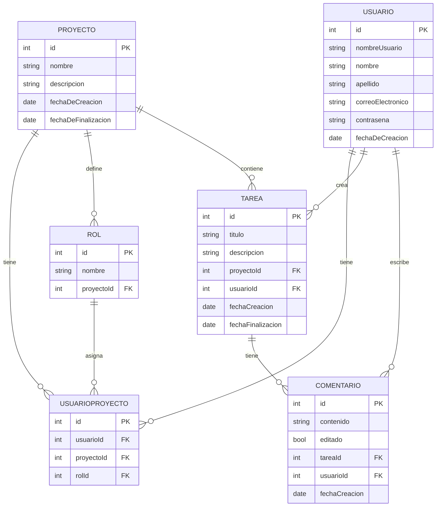

```mermaid
erDiagram
    USUARIO {
        int id PK
        string nombreUsuario
        string nombre
        string apellido
        string correoElectronico
        string contrasena
        date fechaDeCreacion
    }
    PROYECTO {
        int id PK
        string nombre
        string descripcion
        date fechaDeCreacion
        date fechaDeFinalizacion
    }
    ROL {
        int id PK
        string nombre
        int proyectoId FK
    }
    USUARIOPROYECTO {
        int id PK
        int usuarioId FK
        int proyectoId FK
        int rolId FK
    }
    TAREA {
        int id PK
        string titulo
        string descripcion
        int proyectoId FK
        int usuarioId FK
        date fechaCreacion
        date fechaFinalizacion
    }
    COMENTARIO {
        int id PK
        string contenido
        bool editado
        int tareaId FK
        int usuarioId FK
        date fechaCreacion
    }

    USUARIO ||--o{ USUARIOPROYECTO : "tiene"
    PROYECTO ||--o{ USUARIOPROYECTO : "tiene"
    ROL ||--o{ USUARIOPROYECTO : "asigna"
    PROYECTO ||--o{ ROL : "define"
    PROYECTO ||--o{ TAREA : "contiene"
    USUARIO ||--o{ TAREA : "crea"
    TAREA ||--o{ COMENTARIO : "tiene"
    USUARIO ||--o{ COMENTARIO : "escribe"
```
